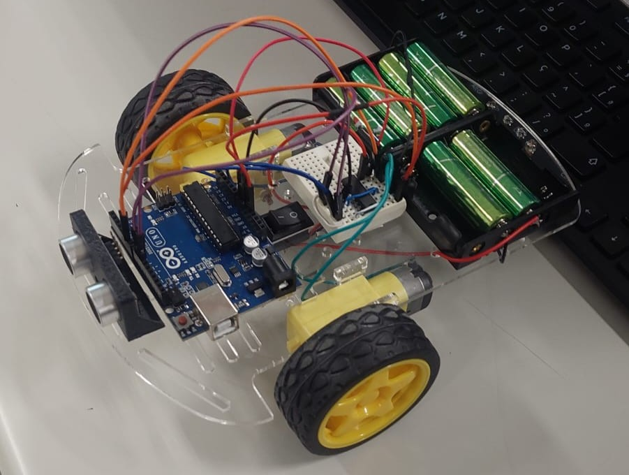

 -

# Projeto Robô com Arduino

**Unidade Curricular 1 - SENAC**

> Realizado no ano de 2025

**Nome do Robô:** Maze Runner Bot  
**Integrantes:** Anderson Wilmer, Reginaldo Filho e Ryan Ferreira  
**Professor:** José de Assis  

---

## Descrição

Neste projeto de robótica educacional apresenta um robô móvel que utiliza um sensor ultrassônico HC-SR04, duas rodas motorizadas e é controlado por um microcontrolador (Arduino). A programação é feita em linguagem C++, utilizando a biblioteca para facilitar a leitura do sensor ultrassônico.

---

## Ilustração do Projeto

---

## Objetivo

O objetivo deste projeto é permitir que qualquer pessoa, especialmente iniciantes, aprenda na prática conceitos de robótica e programação, construindo um robô capaz de navegar em um labirinto e desviar de obstáculos de forma autônoma.

---

## Tecnologias

Para desenvolver este projeto, utilizamos ferramentas simples e acessíveis para iniciantes:

### Ferramentar Digitais

 **1. IDE Arduino**
 
Link: [https://www.arduino.cc/en/software](https://www.arduino.cc/en/software)

Passo a passo para baixar e instalar:   
1. Acesse o link acima.  
2. Clique na versão correspondente ao seu sistema operacional (Windows, Mac ou Linux).  
3. Baixe o instalador.  
4. Execute o instalador e siga as instruções para completar a instalação.  
5. Abra a IDE e verifique se funciona corretamente.

**2. Tinkercad**

Link: [https://www.tinkercad.com/](https://www.tinkercad.com/)

Passo a passo para acessar:  
1. Acesse o link acima.  
2. Clique em "Join Now" ou "Sign In".  
3. Crie uma conta gratuita ou entre com sua conta existente.  
4. No painel, escolha "Circuits" para criar e simular o esquema elétrico do robô.

### Ferramentas Fisicas

- Ferro de solda.
- Estanho para solda.
- Chave de fenda ou philips.
- Alicate de corte.
- Multímetro.

---

## Wiki

Para seguir o projeto passo a passo, incluindo lista de materiais, montagem do circuito e programação do robô, visite a [wiki do repositório](https://github.com/reginaldotfilho/MazeRunnerBot-arduino/wiki).
